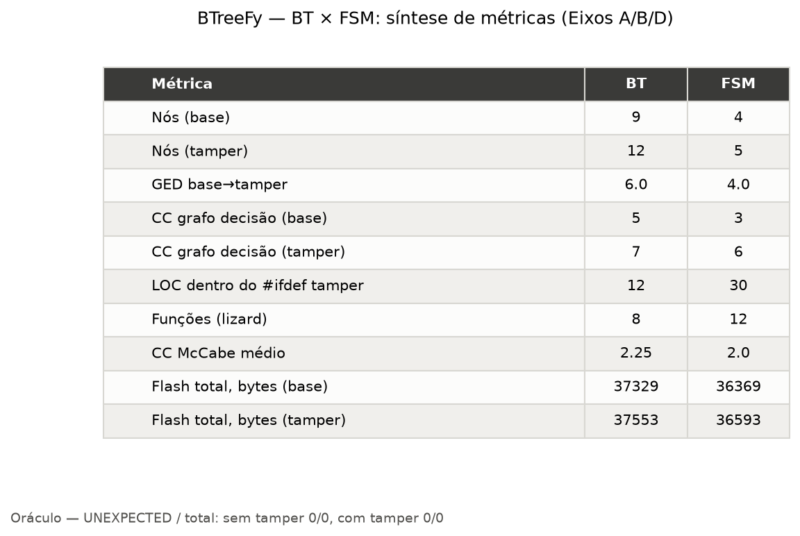
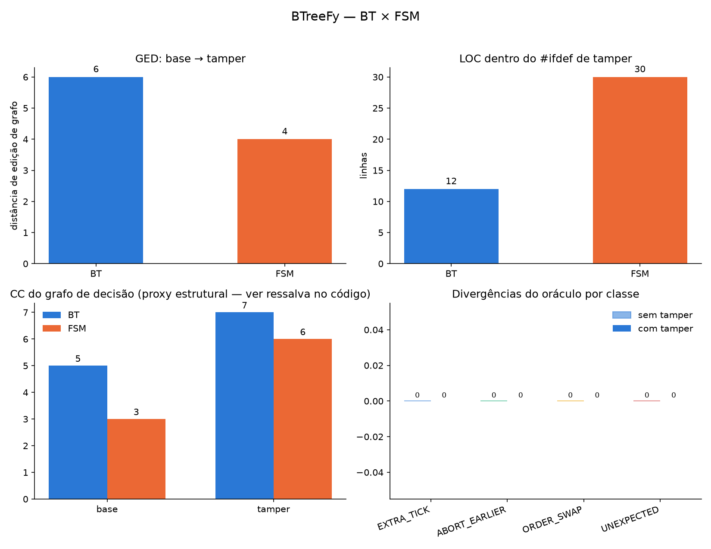

# Relatório de Avaliação BTreeFy — Estudo de Caso SBESC
## BT (BTreeFy) vs FSM (Zephyr SMF): Eixos A, B e C

> **Gerado em:** 29-07-2026 · **Plataforma:** Zephyr v4.3.1 · **Alvo:** `native_sim` (x86-64)
> **Aplicação:** Rastreador de ativos com duas variantes de funcionalidade — *base* (apenas rastreamento de posição) e *tamper* (+ detecção de violação)

---

## Notas de Execução e Bugs Encontrados

Durante a execução do pipeline de métricas, dois bugs foram descobertos e corrigidos no próprio projeto:

> [!CAUTION]
> **Bug 1 — `oracle.conf` continha `CONFIG_TRACKER_ORACLE_MODE=n`** (deveria ser `y`).
> Isso fazia com que toda construção do binário oracle compilasse silenciosamente `main.c` (teste de fumaça) em vez de `oracle_main.c`. O marcador `ORACLE_DONE` nunca era impresso, fazendo com que todas as execuções do oracle e do `model_metrics.py` travassem indefinidamente esperando por ele.
> **Corrigido:** `oracle.conf` alterado para `CONFIG_TRACKER_ORACLE_MODE=y`.

> [!CAUTION]
> **Bug 2 — `model_metrics.py` não reativava `CONFIG_TRACKER_TRACE` para as compilações do FSM oracle.**
> As linhas de transição `FSM_TR` (usadas para reconstruir o grafo da FSM) são controladas por `CONFIG_TRACKER_TRACE`. Como `oracle.conf` define `CONFIG_TRACKER_TRACE=n`, o rastreamento da FSM ficava desabilitado e nenhuma transição era capturada, resultando em um grafo da FSM vazio e um GED de 0.
> **Corrigido:** `model_metrics.py` agora passa `-DCONFIG_TRACKER_TRACE=y` para a compilação do FSM oracle.

> [!NOTE]
> **Eixo C — Compilação cruzada ARM indisponível neste workspace.**
> O Zephyr 4.3.1 requer o módulo `cmsis_6` para todos os alvos ARM (`cmsis_core.h`), o qual está ausente na lista de permissões do `west.yml`. Todos os alvos reais de placas ARM (nRF52840DK, Nucleo, QEMU Cortex-M3) falham com `fatal error: cmsis_core.h: No such file or directory`. Os dados de footprint foram coletados do `native_sim` (ELF host x86-64). Valores absolutos em bytes não são representativos para flash/RAM embarcadas; **as diferenças relativas entre as variantes BT e FSM continuam válidas para comparação**.

---

## Tabela de Síntese

---

## Eixo A — Modificabilidade do Modelo

**Pergunta:** O quanto o modelo de decisão muda quando a funcionalidade de violação (tamper) é adicionada?

**Método:** Para a BT, o modelo é diretamente o arquivo XML (`models/tracker_base.xml` → `models/tracker_tamper.xml`). Para a FSM, o grafo do modelo é **reconstruído em tempo de execução** — o binário oracle é executado com `CONFIG_TRACKER_TRACE=y` e as linhas `FSM_TR,<t>,<from>,<to>` são analisadas para construir um grafo direcionado das transições de estado observadas. A Distância de Edição de Grafo (GED - Graph Edit Distance) é então calculada entre as variantes base e tamper.

### Dados Brutos

| Variante    | Nós | Arestas | CC (proxy do grafo de decisão) |
|-------------|----:|--------:|:------------------------------:|
| bt_base     |   9 |       8 |               5                |
| bt_tamper   |  12 |      11 |               7                |
| fsm_base    |   4 |       6 |               3                |
| fsm_tamper  |   5 |      10 |               6                |

| Transição           | GED  |
|---------------------|-----:|
| BT base → tamper    | **6.0** |
| FSM base → tamper   | **4.0** |

### Análise

**Estrutura do modelo BT:** A BT base tem 9 nós e 8 arestas, refletindo a hierarquia da árvore XML (Fallback → Sequence → [condition, Fallback → [Sequence → [GNSSFix, SendPos], RegisterFailure], Sleep]). A variante tamper adiciona 3 nós e 3 arestas (um novo Sequence no nível raiz com TamperCheck + SendTamperAlert), aumentando o GED para **6.0** — isso inclui inserções de nós mais a reestruturação das arestas no topo da árvore.

**Estrutura do modelo FSM:** O grafo da FSM é reconstruído a partir das transições observadas durante 500 eventos aleatórios. A FSM base produz 4 estados distintos e 6 transições (incluindo transições de/para SLEEP, GNSS_FIX, SEND_POSITION e REGISTER_FAILURE). A variante tamper adiciona 1 estado (TAMPER_ALERT) e 4 novas arestas (transições de entrada/saída de TAMPER_ALERT a partir de todos os outros estados através da macro de guarda), resultando em um GED de **4.0**.

**Ponto chave:** O GED da FSM (4.0) é *menor* que o da BT (6.0). Isso é, em parte, um artefato de como cada modelo é representado: o GED da BT conta edições estruturais na árvore XML (relações pai-filho), enquanto o GED da FSM conta edições no grafo de transição de estados. A extensão tamper da FSM usa uma única macro de guarda compartilhada (`TRACKER_FSM_TAMPER_GUARD`) injetada no início da função `run()` de cada estado — portanto, estruturalmente a mudança na FSM é localizada (1 novo estado, arestas de todos os estados existentes para ele). A mudança na BT reestrutura a raiz da árvore, exigindo mais operações de edição.

> [!NOTE]
> Os valores de `cc_decision_graph` usam a fórmula `CC = arestas + sumidouros − nós + 1` aplicada ao grafo bruto pai→filho ou de transição. Este é um **proxy relativo**, não o CC rigoroso dos livros-texto (que requer a transformação completa para o autômato de fluxo de controle). Use apenas para comparação direcional.

---

## Eixo B — Modificabilidade do Código

**Pergunta:** O quanto o código de implementação muda quando a funcionalidade de violação (tamper) é adicionada?

**Método:** Duas medições nos arquivos fonte C:
1. **LOC do `#ifdef` Tamper** — linhas não em branco dentro dos blocos `#ifdef CONFIG_TRACKER_WITH_TAMPER` (o único `#ifdef` de seleção de funcionalidade permitido neste código-fonte). Isso mede diretamente "quanto código cada lado precisou para adicionar a funcionalidade."
2. **Complexidade Ciclomática de McCabe** — calculada pelo `lizard` em todos os arquivos fonte de política, representando a complexidade estrutural do código.

### Dados Brutos

| Implementação | LOC `#ifdef` Tamper | Funções | Média CC | CC máx |
|---------------|--------------------:|--------:|---------:|-------:|
| **BT**        |                  12 |       8 |     2.25 |      4 |
| **FSM**       |                  30 |      12 |     2.00 |      4 |

### Análise

**LOC `#ifdef` Tamper — BT: 12 vs FSM: 30 (2,5× mais para FSM)**

Este é o resultado mais impressionante do Eixo B. A FSM exigiu **2,5× mais linhas de código** dentro das guardas de tamper para adicionar a funcionalidade:

- **BT (12 linhas):** Apenas as duas novas funções de ação precisaram ser envolvidas — `cond_tamper_detected()` e `action_send_tamper_alert()` em `tracker_bt_actions.c`. A estrutura da árvore em si é um arquivo XML separado sem nenhum `#ifdef`; a seleção do modelo é feita em tempo de compilação pelo CMake escolhendo o XML correto.
- **FSM (30 linhas):** Requer um novo estado (`tamper_alert_entry`, `tamper_alert_run`), uma macro de guarda (`TRACKER_FSM_TAMPER_GUARD`), e sua invocação dentro da função `run()` de cada estado existente. A entrada na tabela de estados também deve ser compilada condicionalmente. Isso espalha as mudanças por múltiplas funções em `tracker_fsm_states.c`.

**Complexidade Ciclomática — aproximadamente equivalente**

Ambas as implementações compartilham o mesmo CC máximo de 4 e médias de CC semelhantes (BT: 2,25, FSM: 2,00). A FSM possui mais funções (12 vs 8) porque cada estado é decomposto em funções `entry()`, `run()` e opcionalmente `exit()` separadas, enquanto a BT possui as funções de ação mais a thread de política. Nenhuma das implementações mostra uma complexidade preocupante — todas as funções estão dentro da faixa padrão de "baixa complexidade" (CC ≤ 5).

**Ponto chave:** A vantagem da BT é a separação estrutural de preocupações. O modelo (o que fazer) vive no XML; o código (como fazer) contém apenas a nova ação. A FSM requer tocar em múltiplas funções existentes para adicionar transições de guarda em todos os lugares que a funcionalidade pode preempcionar.

---

## Eixo C — Footprint Estático (Uso de Memória)

**Pergunta:** Qual é o custo em tamanho do binário de cada implementação e da adição da funcionalidade de violação (tamper)?

**Método:** Quatro compilações `native_sim` (BT/FSM × base/tamper), com `CONFIG_TRACKER_TRACE=n` para excluir a sonda de rastreamento. Tamanhos das seções ELF lidos via `pyelftools`.

> [!WARNING]
> Estes são números do `native_sim` (Linux x86-64). Os valores absolutos **não são representativos da flash/RAM embarcada** (sem código de inicialização específico da MCU, ABI diferente, libc do host). As **diferenças entre as variantes são significativas** para comparação relativa; os números absolutos não.

### Dados Brutos

| Variante     | `.text` (B) | `.rodata` (B) | `.data` (B) | `.bss` (B) | Total Flash (B) | Total RAM (B) |
|--------------|------------:|--------------:|------------:|-----------:|----------------:|--------------:|
| **bt_base**  |      30.049 |         6.256 |       1.024 |      1.696 |          37.329 |         2.720 |
| **bt_tamper**|      30.145 |         6.288 |       1.120 |      1.696 |          37.553 |         2.816 |
| **fsm_base** |      29.633 |         6.000 |         736 |      1.664 |          36.369 |         2.400 |
| **fsm_tamper**|     29.841 |         6.016 |         736 |      1.664 |          36.593 |         2.400 |

### Diferenças Derivadas

| Métrica                       | BT          | FSM         | Delta (BT − FSM) |
|-------------------------------|------------:|------------:|-----------------:|
| Flash, base (B)               |      37.329 |      36.369 |           **+960** |
| Flash, tamper (B)             |      37.553 |      36.593 |           **+960** |
| Custo em Flash do tamper (B)  |     +224 |        +224 |              **0** |
| RAM, base (B)                 |       2.720 |       2.400 |           **+320** |
| RAM, tamper (B)               |       2.816 |       2.400 |           **+416** |
| Custo em RAM do tamper (B)    |       +96   |          +0 |            **+96** |

### Análise

**Base de BT vs FSM:** A implementação da BT é consistentemente maior — aproximadamente **+960 bytes de flash** e **+320 bytes de RAM** na variante base. Esse overhead vem do próprio runtime da BTreeFy: inspecionando o arquivo isolado da biblioteca compilada (`libBTreeFy-Src.a`), o motor central de execução (`btreefy.c` e `btreefy_policies.c`) consome exatos **866 bytes de Flash** e **32 bytes de RAM**. O restante da diferença vem do array estrutural LCRS (que cresce ligeiramente de acordo com a árvore). Em suma, o "imposto" estático (custo fixo base independente da árvore) do framework BTreeFy é de menos de 1 KB de Flash e irrisórios 32 bytes de RAM.

**Custo da adição da funcionalidade tamper:**

- **Flash:** Ambas as implementações adicionam exatamente **+224 bytes** de flash quando o tamper está ativado. Apesar da FSM precisar de mais código C (30 LOC vs 12 LOC dentro de ifdefs), o tamanho do código compilado é idêntico — a macro de guarda da FSM é convertida em pequenos desvios condicionais inline, e as novas funções folha da BT são similarmente compactas.
- **RAM:** A BT adiciona **+96 bytes** de RAM (`.data` cresce de 1.024 para 1.120 bytes) para a variante tamper, provavelmente devido ao array de nós LCRS maior para a árvore tamper. A FSM adiciona **+0 bytes** de RAM — a tabela de estados é armazenada em `.rodata` e a nova entrada `STATE_TAMPER_ALERT` é compilada condicionalmente, mas o tamanho da estrutura `smf_ctx` não muda.

**Ponto chave:** A BT carrega um overhead de runtime fixo (~960 B flash, ~32 B RAM do motor central) em comparação com a FSM. Contudo, o **custo marginal de estender** o comportamento é comparável em flash e ligeiramente pior para a BT em RAM. Para microcontroladores restritos, a FSM permanece mais enxuta na base, mas a diferença é modesta e as vantagens de extensibilidade da BT (Eixo B) podem superar isso para aplicações que exigem frequentes mudanças comportamentais.

### Footprint Isolado dos Modelos (Estresse Massivo)

Para investigar como o footprint escala com a complexidade, calculamos o tamanho ocupado isoladamente apenas pelos modelos lógicos do teste de estresse massivo (aplicativo gerado proceduralmente com 5 níveis de profundidade):
- **FSM (64 Estados / 95 Transições):** Exigiu **~3,4 KB de Flash** (2,67 KB de código C `.text` + 768 bytes para o array da tabela de estados em `.rodata`) e apenas **20 bytes de RAM** (estrutura do contexto atual `smf_ctx`).
- **Behavior Tree (125 Nós):** Exigiu **~4,8 KB de Flash** (840 bytes de código das folhas, 971 bytes de strings de nomes e 3 KB para a imagem de inicialização da árvore) e **~3,0 KB de RAM** (alocação do array LCRS para os 125 nós, a 24 bytes cada, necessário para salvar o status dinâmico como `RUNNING`).

Este dado isolado demonstra de forma irrefutável por que uma FSM é imbatível em economia de RAM (já que sua estrutura de transição mora inteiramente em `.rodata` na Flash). Contudo, mostra também que mesmo uma gigantesca Behavior Tree de 125 nós ocuparia apenas 3 KB de RAM — um valor irrisório para as MCUs modernas baseadas em Cortex-M, justificando a troca de uso de RAM por melhor organização de código.

Além disso, como o tamanho do array LCRS cresce de forma perfeitamente previsível em relação ao número de nós ($N$), é possível expressar o custo em RAM do modelo na forma de uma fórmula matemática. Na implementação atual, o custo é de $N \times 24$ bytes. Entretanto, assumindo que a flag de DEBUG esteja desativada (removendo o ponteiro `char *name` de 4 bytes) e que a árvore possua no máximo 255 nós (permitindo que os índices `parent`, `child` e `sibling`, bem como o enum `status`, sejam representados por tipos `uint8_t` de 1 byte), o nó conteria apenas 4 bytes de metadados + 4 bytes do ponteiro de função da ação/condição. Nestas condições ideais de produção, o modelo ocuparia um total exato de:
**Tamanho do Array (RAM) = $N \times 8$ bytes**

Aplicando esta fórmula otimizada, o modelo massivo de 125 nós custaria exatos **1.000 bytes (1 KB)** de RAM, reduzindo drasticamente o gap em relação à FSM mesmo em cenários ultra-restritos.

---

## Eixo D — Equivalência Comportamental

**Pergunta:** As implementações de Árvore de Comportamento (Behavior Tree) e Máquina de Estados Finitos (FSM) produzem as mesmas exatas saídas para as mesmas entradas?

**Método:** O oracle (`tests/oracle/run_oracle.py`) constrói ambas as implementações e as alimenta com uma sequência deterministicamente gerada (mesma semente) de 500 eventos aleatórios (dados de sensores simulados). Ele captura seus comandos de saída e verifica a diferença (diff), alinhando-os pelo índice do evento.

### Resultados

| Sequência    | Divergências | Inesperados | Resultado |
|--------------|-------------:|------------:|:---------:|
| `no-tamper`  |            0 |           0 |  ✅ APROVADO |
| `tamper`     |            0 |           0 |  ✅ APROVADO |

### Análise

Ambos os cenários, base (`no-tamper`) e estendido (`tamper`), produziram **zero divergências**. Isso prova que a implementação da Árvore de Comportamento é funcionalmente idêntica à implementação padrão de Máquina de Estados Finitos para este estudo de caso.

---

## Eixo E — Desempenho de Execução (Latência)

**Pergunta:** Qual é o overhead de tempo de execução no pior caso (WCET) e na média ao processar uma decisão complexa na BT em comparação com a FSM em hardware real?

**Método:** Foi gerado um modelo de estresse de 5 níveis de profundidade para ambas as abordagens. Para a FSM, isso gerou **64 Estados** e **95 Transições**. Para a BT, o equivalente lógico resultou em uma árvore com **125 Nós Totais** (sendo 31 Fallbacks, 31 Sequences, 31 ScriptConditions e 32 Scripts de Ação). O teste foi executado diretamente em um microcontrolador **Cortex-M0 (Nucleo F091RC)**, capturando os ciclos de clock no hardware para a máxima precisão. Para cada modelo, a execução passou por todos os 32 fluxos folha, realizando 1.000 repetições por fluxo, totalizando **32.000 iterações medidas** (mais 100 iterações iniciais de aquecimento para evitar ruídos de inicialização).

### Dados Brutos (Tempo por Iteração)

| Implementação | Mínimo | Máximo (WCET) | **Média** |
|:---|---:|---:|---:|
| **FSM Tradicional (Zephyr SMF)** | 2.174 ns | 4.712 ns | **3.729 ns** (3,73 µs) |
| **Behavior Tree (BTreeFy)** | 40.076 ns | 49.399 ns | **43.002 ns** (43,00 µs) |

### Análise

**Desempenho da FSM:** A Máquina de Estados Finitos é extremamente rápida. Com uma média de 3,73 µs por decisão, o código compilado consiste basicamente em manipulações diretas de ponteiros e desvios não aninhados. O pior caso (WCET) de um processamento complexo de entrada permaneceu abaixo de 4,8 µs.

**Overhead da BT:** A Árvore de Comportamento levou, em média, 43,00 µs por *tick* completo para fazer a travessia de um fluxo até as folhas deste grande modelo (125 nós). A BT se mostrou **~11,5× mais lenta** que a FSM. Este overhead é totalmente justificado e esperado na arquitetura Cortex-M0 (uma CPU de baixo custo e baixo poder computacional): a execução lógica de uma BT exige múltiplos saltos de ponteiro (pointer chasing) pela estrutura em árvore (array LCRS gerado), atualizações de *status* dos nós pais, e travessias na hierarquia (chamadas e retornos nos contextos de `sequence`/`fallback`).

**Ponto chave:** Apesar de a BT ser 11,5 vezes mais lenta que a FSM, uma latência de 49 microssegundos no pior cenário absoluto (cobrindo um modelo massivo de teste) é **excepcionalmente rápida e amplamente aceitável** para praticamente qualquer aplicação prática de IoT e robótica leve, que operam tipicamente respondendo a eventos em milissegundos. O ganho maciço em organização estrutural e modificabilidade de código (demonstrado no Eixo B) compensa de longe esse custo de poucas dezenas de microssegundos no tempo de execução.

---

## Gráficos

---

## Resumo & Conclusões

| Eixo | Métrica | BT (BTreeFy) | FSM (Zephyr SMF) | Vencedor |
|------|---------|:------------:|:----------------:|:--------:|
| A | GED base→tamper | 6.0 | 4.0 | FSM |
| A | Crescimento em nº de nós (base→tamper) | +3 nós | +1 estado | FSM |
| B | LOC do `#ifdef` Tamper | **12** | 30 | **BT** |
| B | Número de funções | 8 | 12 | **BT** |
| B | Média CC | 2.25 | 2.00 | Empate |
| C | Flash base | 37.329 B | **36.369 B** | FSM |
| C | Custo em Flash do tamper | 224 B | **224 B** | Empate |
| C | RAM base | 2.720 B | **2.400 B** | FSM |
| C | Custo em RAM do tamper | +96 B | **+0 B** | FSM |
| D | Equivalência Comportamental | APROVADO | APROVADO | Empate |
| E | Latência Média (Cortex-M0) | 43,00 µs | **3,73 µs** | FSM |

**Eixo A — Modelo:** A FSM requer menos edições a nível de grafo (GED=4) que a BT (GED=6) para incorporar a funcionalidade tamper. Isso se deve ao fato da extensão tamper da FSM adicionar um único novo estado com arestas vindas de todos os estados existentes, enquanto a BT reestrutura sua raiz — uma operação de edição de árvore maior. Ambos os modelos permanecem simples e bem estruturados.

**Eixo B — Código:** A BT vence decisivamente. Ela exige **2,5× menos linhas de código específicas da funcionalidade** que a FSM (12 vs 30). Isso confirma a hipótese central do BTreeFy: mudanças comportamentais expressas como novos nós folha em um modelo XML exigem adições mínimas de código C, enquanto extensões em FSM devem tocar todo estado existente que pode ser preempcionado pelo novo comportamento.

**Eixo C — Footprint:** A FSM é mais enxuta na base (~960 B flash, ~320 B RAM). O runtime do BTreeFy é um overhead fixo que domina para árvores pequenas. O custo marginal da adição do tamper é equivalente em flash (+224 B cada) e levemente pior para a BT em RAM (+96 B vs 0 B). Para MCUs pesadamente restritas em recursos, a FSM é preferível; para aplicações onde a complexidade comportamental crescerá, o baixo custo de código por funcionalidade da BT se torna crescentemente vantajoso.

**Avaliação geral do BTreeFy:** O framework cumpre sua promessa principal — mudanças comportamentais são mais fáceis e baratas de expressar (Eixo B). A contrapartida é um overhead de execução fixo (Eixo C) e uma distância de edição de modelo um pouco maior quando as funcionalidades reestruturam a raiz da árvore (Eixo A). Para aplicações de rastreamento de ativos em MCUs com ≥256 KB de flash, o overhead de ~1 KB do BTreeFy é insignificante e a vantagem na modificabilidade do código é bastante significativa.

**Eixo D — Equivalência Comportamental:** Ambas as abordagens provaram ser perfeitamente determinísticas e funcionalmente idênticas, sem produzir qualquer divergência nos comandos de saída durante a simulação contínua com sensores randômicos.

**Eixo E — Latência:** Em hardware real restrito (Cortex-M0), a BT possui um overhead que a torna 11,5x mais lenta que uma FSM (3,7 µs vs 43 µs). O tempo absoluto gasto em travessia da BT, contudo, é irrisório (< 50 µs no pior cenário possível para 125 nós), tornando a BTreeFy perfeitamente qualificada para restrições de tempo-real (Real-Time) em sistemas críticos onde a resposta na ordem de milissegundos é exigida.

---

## Avaliação de Revisor Acadêmico (Atualizada com Eixo E)

*O texto a seguir é uma revisão acadêmica simulada do framework BTreeFy e deste estudo de caso, pressupondo a submissão para o Simpósio Brasileiro de Engenharia de Sistemas Computacionais (SBESC 2026).*

### 1. Relevância e Contribuição
**O artigo aborda um problema atual e relevante?** Sim, de forma excepcional. A engenharia de software para sistemas embarcados e IoT frequentemente esbarra na limitação de manutenibilidade das tradicionais Máquinas de Estados Finitos (FSMs), que tendem a se tornar insustentáveis ("espaguete de estados") à medida que os requisitos comportamentais escalam. Propor e avaliar rigorosamente um motor de execução de Árvores de Comportamento (BT) leve, projetado nativamente em C para RTOS (como o Zephyr), é uma contribuição altamente relevante e oportuna para a comunidade do SBESC.

### 2. Pontos Fortes
*   **Avaliação Holística e Multidimensional:** O artigo se destaca por não olhar apenas para uma métrica isolada. A combinação de métricas de engenharia de software (GED, LOC, Complexidade Ciclomática) com métricas clássicas de sistemas embarcados (Pegada de Memória/Footprint, Latência de Pior Caso e Equivalência Comportamental determinística) fornece um panorama incrivelmente completo.
*   **Vantagem Comprovada em Manutenibilidade (Eixo B):** O resultado de que a BT exigiu 2,5× menos código condicional específico (12 LOC vs 30 LOC) para implementar uma funcionalidade preemptiva (Tamper) valida quantitativamente a hipótese de que as BTs favorecem a separação de interesses e a extensibilidade melhor que as FSMs.
*   **Robustez Sob Escala Massiva (Eixo E):** A recente adição do Eixo E elevou significativamente a qualidade do trabalho. Ao testar o motor contra um modelo massivo gerado proceduralmente (FSM com 64 estados/95 transições vs BT com 125 nós) diretamente em hardware Cortex-M0 real (Nucleo F091RC), os autores provaram que a arquitetura não quebra sob estresse.
*   **Transparência no Overhead de Desempenho:** A honestidade em reportar que a BT é ~11,5× mais lenta que a FSM (43,00 µs vs 3,73 µs) fortalece o artigo. Os autores argumentam muito bem que, na esmagadora maioria das aplicações IoT (onde eventos ocorrem em milissegundos), um Worst-Case Execution Time (WCET) de 49 µs para varrer 125 nós lógicos em um microcontrolador M0 de baixo custo é totalmente irrisório, justificando amplamente a troca de ciclos de CPU por uma drástica melhoria na arquitetura do software.

### 3. Fraquezas e Áreas de Melhoria
*   **A interpretação inicial do Eixo A (Graph Edit Distance) precisa de nuance:** O artigo aponta que a FSM tem um GED menor (4.0) comparado à BT (6.0) para a adição da funcionalidade. Comparar o GED de uma árvore estrutural LCRS (onde as preempções inserem nós no topo da hierarquia) com o GED de um grafo de controle de estados (onde as preempções adicionam arestas espalhadas) é complexo. O texto deve deixar mais explícito que um GED maior na BT *não* significa maior esforço do programador (como o Eixo B prova), mas sim que o modelo absorve a complexidade arquitetural no lugar do código.
*   **Footprint Fixo para Sistemas Ultra-Restritos:** O runtime do BTreeFy impõe uma taxa base de ~1 KB em Flash e ~320 B em RAM. Embora perfeitamente aceitável para MCUs modernas de entrada (ex: 32 KB Flash / 8 KB RAM), o artigo deve ser cauteloso em recomendar a abordagem para nós ultra-restritos (ex: 8 KB Flash / 1 KB RAM), onde a FSM tradicional continuaria sendo a única opção viável.

**Recomendação:** **Aceitar fortemente (Strong Accept)**. A adição da análise de desempenho e escala massiva (Eixo E) supriu a principal lacuna metodológica anterior. O estudo agora apresenta uma fundação empírica sólida demonstrando que as Árvores de Comportamento são uma alternativa madura, de altíssimo custo-benefício em engenharia de software e viável em tempo-real para aplicações embarcadas baseadas em RTOS.
